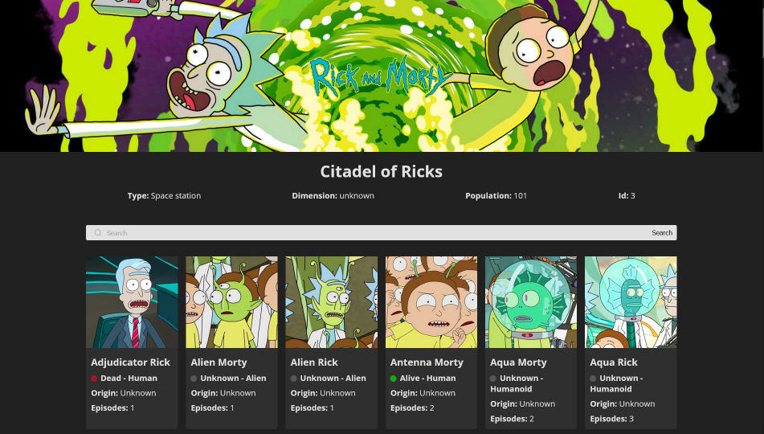

# Rick And Morty Wiki

Created using the [Rick And Morty](https://rickandmortyapi.com/), thanks!.  
Check out my app running on netlify here: <a href="https://rick-and-morty-nine-sigma.vercel.app/" target="_blank">Rick And Morty</a>

## Screenshots



## Features

- Responsive Design
- Animated Status
- Searchbar
- API consume

## Run Locally

Clone the project

```bash
  git clone https://github.com/MarceloGtz/Rick-And-Morty.git
```

Go to the project directory

```bash
  cd Rick-And-Morty
```

Install dependencies

```bash
  npm install
```

Start the server

```bash
  npm run dev
```

## Tech Stack

- Html 5
- Css 3
- JavaScript
- React
- JSON
- API

## Acknowledgements

- [Readme Editor](https://readme.so/es)
- [Rick And Morty](https://rickandmortyapi.com/)
